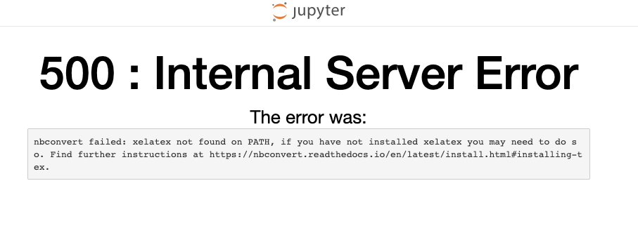

# JupyterLab on Docker で PDF や Latex でダウンロードできるまで

AI や機械学習で遊ぶため(お勉強)**JupyterLab**の環境を Docker で作りました。
**JupyterLab**は動いたのですが PDF や Letax でダウンロードするには**texlive-full**を追加しなければいけないことになった。

しかし、**texlive-full**の Build(docker-composer build とか)にかなり時間がかかりました。(30 分超)
最初の一回だけならいいのですが Python のライブラリを追加した場合などは再 Build することになります。

再 Build の度に 30 分超の時間は[めんどくさい]{.under_line}ので**texlive-full**のインストールを**Dockerfile**ではなく**DockerImage**内でインストールしておく**
DockerImage**を作成。\
作成した**DockerImage**を[DockerHub](https://cloud.docker.com/repository/docker/webdimension/jupyter-latex){target="\_blank"
rel="noopener noreferrer"}へ、Source を[GitLab](https://gitlab.com/webdimension/python){target="\_blank" rel="noopener
noreferrer"}へ登録しました。

## 既存の DockerImage から JupyterLab を構築

ネットからほぼコピペの Dockerfile だと

```bash
FROM python:3.7.3-slim-stretch

ENV PYTHONPATH "/opt/python/library"

COPY requirements.txt /tmp/requirements.txt

RUN apt-get update && apt-get -y upgrade

RUN set -x && \
    pip install -U pip && \
    pip install -r /tmp/requirements.txt && \
    mkdir -p /opt/python/library && \
    mkdir -p /opt/python/jupyter && \
    mkdir -p /opt/python/jupyterlab && \
    mkdir ~/.jupyter && \
    mkdir ~/.src && \
    rm /tmp/requirements.txt

COPY jupyter/jupyter_notebook_config.py /root/.jupyter/jupyter_notebook_config.py

RUN jupyter labextension install jupyterlab_vim \
      && jupyter labextension install @jupyter-widgets/jupyterlab-manager \
      && jupyter labextension install @jupyterlab/toc \
      && jupyter labextension install jupyterlab-favorites \
      && jupyter labextension install jupyterlab-recents

EXPOSE 8888
CMD ["jupyter", "lab", "--allow-root"]
```

これでも**JupyteLab**自体動作しますがメニューの
"File -\> Export Nootebook as "から PDF や Latex でダウンロードしようとするとエラーが発生。



調べたところ**texlive-full**をインストールすれば解決するらしい。
**texlive-full**のインストールを追記した**Dockerfile**が以下。

```bash
FROM python:3.7.3-slim-stretch

ENV PYTHONPATH "/opt/python/library"

COPY requirements.txt /tmp/requirements.txt

RUN apt-get update && apt-get -y upgrade
RUN apt-get install -y \
    curl \
    gnupg \
    pandoc
RUN curl -sL https://deb.nodesource.com/setup_11.x | bash -
RUN apt-get install -y nodejs
RUN npm install npm@latest -g

RUN set -x && \
    pip install -U pip && \
    pip install -r /tmp/requirements.txt && \
    mkdir -p /opt/python/library && \
    mkdir -p /opt/python/jupyter && \
    mkdir -p /opt/python/jupyterlab && \
    mkdir ~/.jupyter && \
    mkdir ~/.src && \
    rm /tmp/requirements.txt

COPY jupyter/jupyter_notebook_config.py /root/.jupyter/jupyter_notebook_config.py

RUN jupyter labextension install jupyterlab_vim \
      && jupyter labextension install @jupyter-widgets/jupyterlab-manager \
      && jupyter labextension install @jupyterlab/toc \
      && jupyter labextension install jupyterlab-favorites \
      && jupyter labextension install jupyterlab-recents

EXPOSE 8888

ADD xelatex/packages.txt .
RUN apt-get update && \
    # Install packages
    apt-get install -y $(cat packages.txt) && \
    # Removing documentation packages *after* installing them is kind of hacky,
    apt-get --purge remove -y .\*-doc$ && \
    # Remove more unnecessary stuff
    apt-get clean -y && \
    # Create directory for iso690
    mkdir -p "$(kpsewhich -var-value TEXMFHOME)" && \
    # Change directory
    cd "$(kpsewhich -var-value TEXMFHOME)" && \
    # Clone repository
    git clone https://github.com/michal-h21/biblatex-iso690.git && \
    # Run texhash
    texhash
CMD ["jupyter", "lab", "--allow-root"]
```

これで PDF や Latex でダウンロードできるようになりました。しかし build にかなり時間がかかります。(30 分超)。 最初の一回だけならまだいいのですがこの Dockerfile だと

```bash
COPY requirements.txt /tmp/requirements.txt
...
...
pip install -r /tmp/requirements.txt && \
```

この部分で python のパッケージを pip でインストールしています。
**pandas**などのパッケージを追加する場合は requirements.txt に**pandas**を追記して build するようになります。 このままだとライブラリを追加する度に 30 分以上かかり[めんどくさい]
{.under_line}ので Dockerfile は最小限にして**JupyterLab**,**texlive-full**のインストールは DockerImage 側でするような DockerImage を用意します。

## JupyterLab,exlive-full 環境構築のための DockerFile

DockerImage を作るための Dockerfile です。

```bash
FROM python:3.7.3-slim-stretch

RUN apt-get update && apt-get -y upgrade
RUN apt-get install -y \
    curl \
    gnupg \
    pandoc

RUN curl -sL https://deb.nodesource.com/setup_11.x | bash -
RUN apt-get install -y nodejs
RUN npm install npm@latest -g

RUN set -x && \
    pip install -U pip && \
    pip install jupyterlab

RUN jupyter labextension install jupyterlab_vim \
      && jupyter labextension install @jupyter-widgets/jupyterlab-manager \
      && jupyter labextension install @jupyterlab/toc \
      && jupyter labextension install jupyterlab-favorites \
      && jupyter labextension install jupyterlab-recents

ADD xelatex/packages.txt .
RUN apt-get update && \
    # Install packages
    apt-get install -y $(cat packages.txt) && \
    # Removing documentation packages *after* installing them is kind of hacky,
    apt-get --purge remove -y .\*-doc$ && \
    # Remove more unnecessary stuff
    apt-get clean -y && \
    # Create directory for iso690
    mkdir -p "$(kpsewhich -var-value TEXMFHOME)" && \
    # Change directory
    cd "$(kpsewhich -var-value TEXMFHOME)" && \
    # Clone repository
    git clone https://github.com/michal-h21/biblatex-iso690.git && \
    # Run texhash
    texhash
```

docker-composer.yml

```bash
version: '3'

services:
  jupyterlab:
    build: jupyterlab
    hostname: jupyterlab
    container_name: jupyterlab
```

この Dockerfile では

```bash
pip install jupyterlab
...
RUN jupyter labextension install jupyterlab_vim
...
apt-get install -y $(cat packages.txt)
```

- Python パッケージは**JupyterLab**のみインストール
- **JupyterLab**拡張機能のインストール
- \*texlive-full\*\*

となってます。

## DockerImage を生成し DockerHub へアップロード

- DcokerHub でアカウント登録
- DockerHub でリポジトリの作成 上記が前提です。[Docker Hub](https://hub.docker.com/){target="\_brank" rel="noopener noreferrer"}

DockerImage を生成

```bash
$docker-compose build
```

時間がかかります。 \... 生成された DockerImage を確認

```bash
$docker images
```

生成された**DckerImage**を確認できるかと思います。 生成された**DockerImage**を**DockerHub**へ Push します。 まずは DockerHub へログイン

```bash
$ docker login
# パスワードを入力してログイン
```

新規**DockerImage**を Commit

```bash
$docker commit -a "webdimension" -m "jupyterlab and latex" jupyterlab webdimension/jupyter-latex
# docker commit -a "作者名" -m "コメント" 対象のイメージ名 DockerHubアカウント名/リポジトリ名
```

新規**DockerImage**をリポジトリへ Push

```bash
$docker push webdimension/jupyter-latex
# docker push DockerHubアカウント名/jupyter-リポジトリ名
```

これまた時間がかかります。。。。 無事 Push が完了すれば[DockerHub のレポジトリ](https://cloud.docker.com/repository/list){target="\_brank" rel="
noopener noreferrer"}でも確認してみます。


これで新規 DockerImage を DockerHub へ登録できました。

## DockerHub へ登録した DockerImage から JupyterLab 環境を構築

docker-compose.yml

```bash
version: '3'

services:
  jupyterlab:
    build: jupyterlab
    hostname: jupyterlab
    container_name: jupyterlab
    ports:
      - "8888:8888"
    volumes:
      - ../src:/opt/python/src
      - ../jupyter:/opt/python/jupyter
      - ./jupyterlab:/opt/python/jupyterlab
      - ./jupyterlab/library:/opt/python/librar
```

Dockerfile

```bash
FROM webdimension/jupyter-latex
ENV PYTHONPATH "/opt/python/library"
COPY requirements.txt /tmp/requirements.txt

RUN set -x && \
    pip install -U pip && \
    pip install -r /tmp/requirements.txt && \
    mkdir -p /opt/python/jupyter && \
    mkdir -p /opt/python/src && \
    mkdir -p /opt/python/library && \
    mkdir -p /opt/python/jupyterlab && \
    mkdir ~/.jupyter && \
    rm /tmp/requirements.txt

COPY jupyter_notebook_config.py /root/.jupyter/jupyter_notebook_config.py

EXPOSE 8888
CMD ["jupyter", "lab", "--allow-root"]
```

Build は

- Python パッケージのインストール
- JupyterLab の設定

とシンプルになりと Build 時間も数秒になりました。
